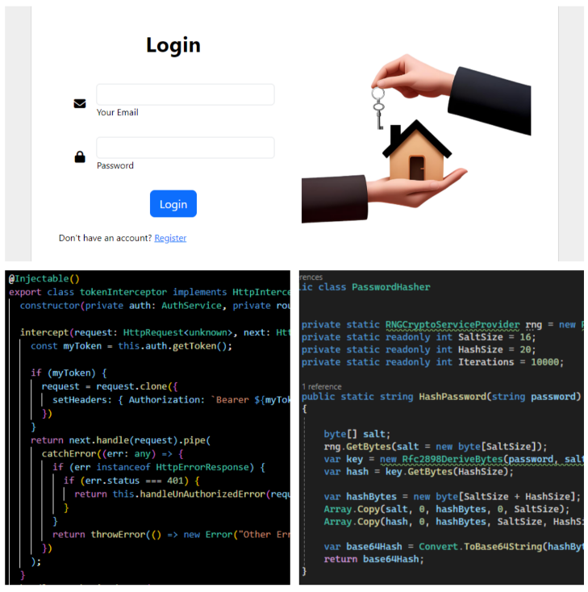

# AdvanceLogin
<!-- Improved compatibility of back to top link: See: https://github.com/othneildrew/Best-README-Template/pull/73 -->

<!-- PROJECT LOGO -->
 

  

  <h3 align="center">Advance Login</h3>

  

    An awesome Login and register With Jwt ,Passwordhash, Refreshtoken Authentication Authorization.
     
    <a href="https://github.com/othneildrew/Best-README-Template"><strong>Explore the docs »</strong></a>
     
  

### Built With

     </a>           

<!-- ABOUT THE PROJECT -->
## About The Project
## Overview

This project is an authentication system designed to manage user registration, login, and secure sessions using JSON Web Tokens (JWT). It features mechanisms for password hashing and token refreshing to enhance security and user experience.

## Key Features

### 1. User Registration
- **Purpose**: Allows new users to create an account.
- **Process**:
  - Users provide their credentials (e.g., username, email, and password).
  - Passwords are hashed using a secure hashing algorithm (e.g., bcrypt) before storage.
  - User data, including the hashed password, is saved in a database.

### 2. User Login
- **Purpose**: Authenticates users and issues access tokens.
- **Process**:
  - Users submit their credentials (username/email and password).
  - The provided password is hashed and compared with the stored hashed password in the database.
  - Upon successful authentication, an access token (JWT) is generated and returned.

### 3. JWT (JSON Web Token)
- **Purpose**: Provides a secure way to transmit information between parties.
- **Usage**:
  - After successful login, a JWT containing user information and an expiration time is generated.
  - The token is signed with a secret key to ensure its integrity and authenticity.
  - The token is included in the `Authorization` header of subsequent requests to access protected routes.

### 4. Refresh Token
- **Purpose**: Allows users to obtain a new access token without re-authenticating.
- **Usage**:
  - Alongside the access token, a refresh token is issued.
  - When the access token expires, the refresh token can be used to request a new access token.
  - Refresh tokens have a longer expiration time and are stored securely on the client-side.

### 5. Password Hashing
- **Purpose**: Enhances security by protecting user passwords.
- **Process**:
  - Passwords are hashed using a strong algorithm (e.g., bcrypt) before storage.
  - During login, the entered password is hashed and compared with the stored hashed password.

## Security Considerations
- **Hashing Algorithm**: Use a strong and well-established hashing algorithm like bcrypt or Argon2.
- **JWT Secret**: Ensure the JWT secret key is kept secure.
- **Token Expiry**: Implement appropriate expiration times for both access and refresh tokens.
- **Secure Storage**: Store refresh tokens securely on the client side (e.g., in HTTP-only cookies).

## Screenshots

Here is a screenshot of the application:

## License

Distributed under the MIT License. See `LICENSE.txt` for more information.

(<a href="#readme-top">back to top</a>)

## Contact

Your Name- Dhruv Patel - dnp1982002@gmail.com

Project Link: https://github.com/Dhruvpatel-7/AdvanceLogin

(<a href="#readme-top">back to top</a>)

